<div style='margin:0 auto;width:50%;'>


</div>

<div id="badges" align="justify">

<br />
Dentro de los seguros, servicios y prestaciones que otorga el ISSSTE a sus derechohabientes, los servicios de urgencias representan una de las áreas más sensibles en las Unidades Médicas, derivado del estado de vulnerabilidad en la que se encuentra el Derechohabiente y su familia.
<br/>
Para la operación de dicho programa se cuenta con prestadores de servicio (Enlaces) en Módulos de Orientación y Vinculación en Urgencias (MOVU), con la finalidad de cubrir los servicios ofertados, y contar con total permanencia en espacios de urgencias (24 horas, los 7 días de la semana, los 365 días del año) y con ello brindar un servicio con calidad y calidez dirigido a la mejora de la satisfacción de los derechohabientes.
<br/>
Es de mencionar que dicho programa fue galardonado por la Asociación Internacional de Seguridad Social (AISS) por buenas prácticas, promoviendo un modelo de atención más humano, cercano y cálido para los usuarios.
<br/>
Para alcanzar ese objetivo, el programa de Trato Digno contaba con una herramienta tecnológica en línea (24x7x365) llamado Sistema Informativo de Bienestar en Salas de Espera de Urgencias (SIBSEU SAD) mismo que fue sustituido por el Sistema de Control de Incidencias y Reporte de Enlaces (SCIRE), permitiendo la interacción y almacenamiento de datos en tiempo real, montado en un ambiente de aplicativo preliminar (versión Beta).
<br/>
En el SCIRE (en su versión preliminar) se registran las actividades de los enlaces como:  permanencia en la jornada y hospital asignado; informe a derechohabientes sobre los servicios del MOVU; número de pláticas sobre el Triage; disponibilidad de sillas de ruedas; registro de incidencias de personal, servicios e infraestructura; seguimiento de incidencias; orientación e informes a derechohabientes; censo sobre pacientes ingresados, egresos, canalizaciones, defunciones, pacientes en observación, familiares; camilleros, enfermeras y médicos; peticiones canalizadas por el programa de Asistencia Telefónica ISSSTE-Tel; reporte diario y quincenal de actividades; directorio de enlaces en Unidades Médicas; entre otros.
<br/>
</div>
<br/>

- [**CONFIGURACION Y CREACION DE LOS CONTENEDORES BACKEND Y FRONTEND**](#configuracion-y-creacion-de-los-contenedores-backend-y-frontend)
- [**INSTALACION DEL APLICATIVO**](#instalacion-del-aplicativo)
- [**EJECUCION DEL APLICATIVO**](#ejecucion-del-aplicativo)
- [**AGREGAR LA BASE DE DATOS AL CONTENEDOR**](#agregar-la-base-de-datos-al-contenedor)
- [**CONSIDERACIONES FINALES**](#consideraciones-finales)

## CONFIGURACION Y CREACION DE LOS CONTENEDORES BACKEND Y FRONTEND

- **Prerrequisitos**

  - Sistema operativo linux, Ubuntu Server 22.04.2
  - Docker versión 24.0.1 o superior.
  - Docker-compose versión 2.17.2 o superior
  - 16 GB de memoria RAM.
  - Procesador a 3.2 GHz con 4MB Cache o superior.
  - Disco duro con capacidad mínima de 100 GB.
  - Puerto USB para Soporte de Instalación, conexión ssh, gitbash o ftps.

  - Tener acceso al código fuente de SIRAESU:

    - Docker-ISSSTE

  - Tener conexión a Internet para la descarga de los componentes y librerias necesarias para la creacion de la aplicacion y los contenedores.

## INSTALACION DEL APLICATIVO

Para la instalacion del aplicativo se necesita la infraestructura de Docker y Docker Compose. El aplicativo se instala de manera local y es necesario descargar de las librerias los requerimientos necesarios para la creacion de la aplicacion y los contenedores.

  - **Crear la dirección de trabajo** <br />
  Ej: /home/usuario/project/docker-issste/

  - **Descargar la carpeta que contiene el codigo fuente de la aplicacion** <br />
  El codigo se descarga directamente del repositorio de GitHub, éste es el comando que se debe ejecutar en la **Terminal (Linux)** ó **CMD/PowerShell (Windows)** dentro de la ruta/direcciond e trabajo:

    ```sh
    git clone http://10.9.70.21/alejandro.galaviz/siraesu.git
    ```

- **Directorios creados despues de descargar el repositorio:** <br />

  - laravel-app
  - readmeImg
  - docker-compose.yml
  - Dockerfile
  - Makefile
  - README.md

  (Ejemplo:) <br />
  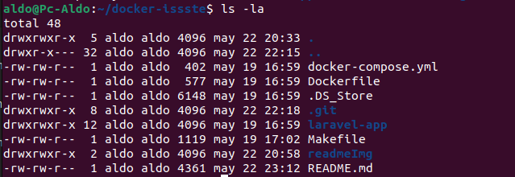 <br />

## EJECUCION DEL APLICATIVO

- **Creacion de los contenedores:** <br />

  - Asegurate que el Docker Desktop se haya instalado correctamente y ejecutalo

    - 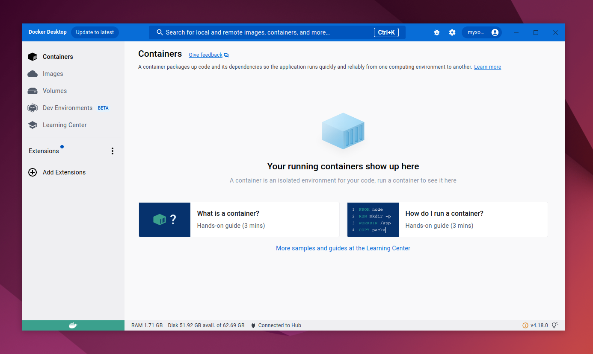 <br /><br />

  - Abre la **Terminal (Linux)** ó **CMD/PowerShell (Windows)** y navega a la ruta en donde descargaste la carpeta

    -  <br /><br />

  - Para construir los contenedores de la Aplicacion y la base de datos, debes ejecutar el siguiente comando el cual descargara y construira todos los modulos para el Backend y el Frontend, recuerda ejetura el comando en la **Terminal (Linux)** ó **CMD/PowerShell (Windows)** dentro de la ruta del proyecto: 
  
    **Ej: /home/usuario/project/siraesu-main/**
  
    ```sh
    docker-compose build --no-cache --force-rm
    ```
  - La construccion del Docker se iniciará despues de ejecutar el comando

    - 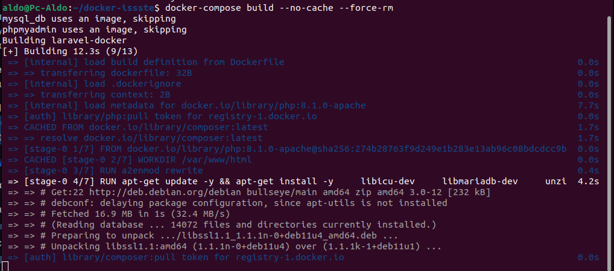 <br />

  - Una vez terminada la creacion del Docker/Contenedor verás una ventana similar a ésta:
  
    - 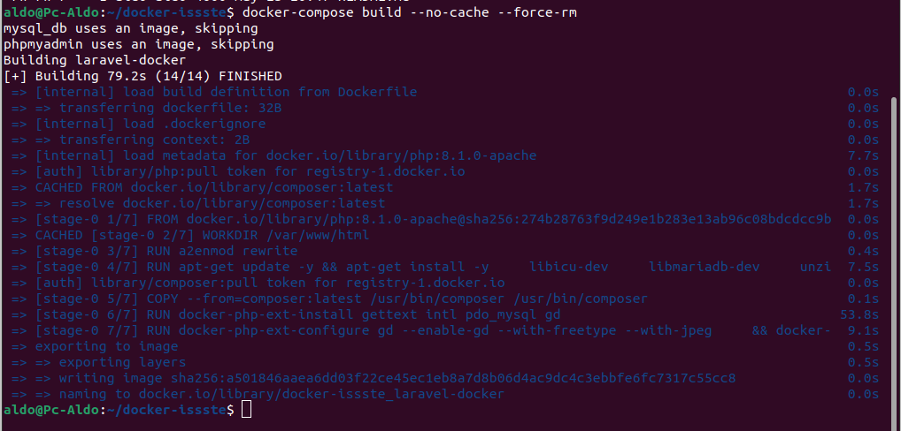 <br /><br />

- **Inicializacion de los contenedores:** <br />

  - Para inicializar los contenedores y que los servicios se ejecuten debes ejecutar el siguiente comando en la **Terminal (Linux)** ó **CMD/PowerShell (Windows)** dentro de la ruta del proyecto

    **Ej: /home/usuario/project/siraesu-main/**
  
    ```sh
    docker-compose up -d
    ```
  - Cuando los servicios se hayan levantado

    - 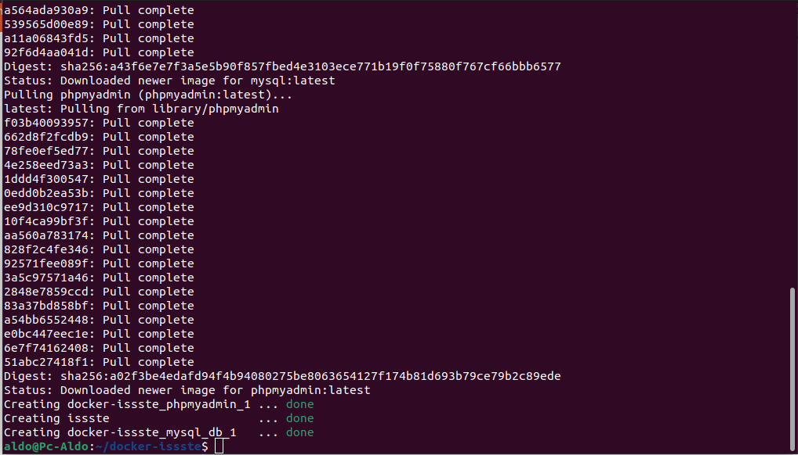 <br />

- **Crear los permisos de escritura en el proyecto:** <br />

  - Para escribir dentro del contenedor de la aplicacion es necesario crear permisos en dos archivos

    **Carpeta Storage**

      - **Ej: /home/usuario/project/siraesu-main/laravel-app/storage**

        Ejecuta los siguientes comandos:
  
        ```sh
        docker exec issste sh -c "chmod -R 775 storage"
        docker exec issste sh -c "chmod -R ugo+rw storage"
        ```

    **Carpeta Evidencia**

      

      Ejecuta los siguientes y asegurate de estar nuevamente en la ruta principal del proyecto:
        
      - **Ej: /home/usuario/project/siraesu-main/**
  
        ```sh
        docker exec issste sh -c "chmod -R 775 public/img/evidencia"
        docker exec issste sh -c "chmod -R ugo+rw public/img/evidencia"
        ```

      - **Limpia el cache de la Aplicacion**

      Ejecuta el siguiente comando desde la ruta principal del proyecto:

      - **Ej: /home/usuario/project/siraesu-main/**
        ```sh
        docker exec issste sh -c "php artisan cache:clear"
        ```

      - **Cuando termines veras una venta similar a ésta**

        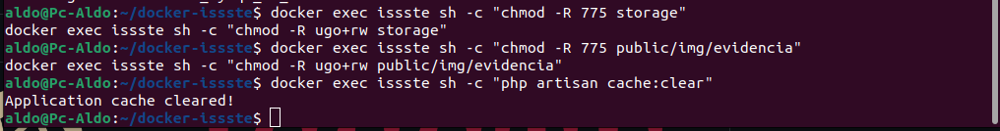 <br />

- **Revision de los contenedores** <br />

    Puedes revisar que los contenedores esten corriendo de dos manera

    - **Docker Desktop**<br />
    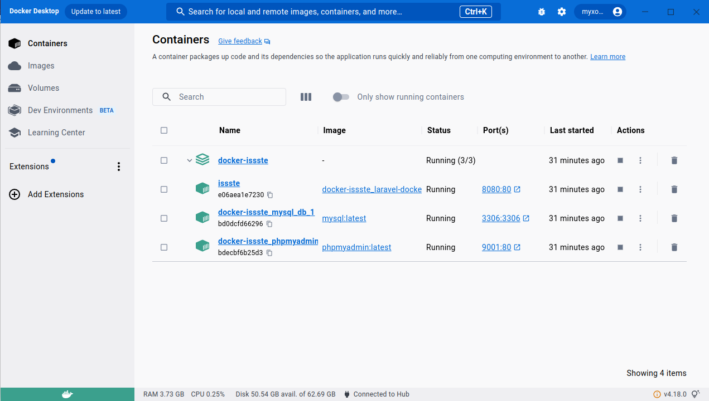 <br />

    - **Terminal (Linux)** ó **CMD/PowerShell (Windows)**<br />
    Ejecuta el siguiente comando:
      ```sh
      docker container ls
      ```
      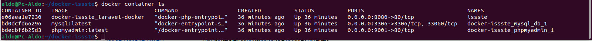 <br />

- **Revision de la Aplicacion** <br />

    Revisar que la aplicacion este corriendo correctamente en el localhost:8080

    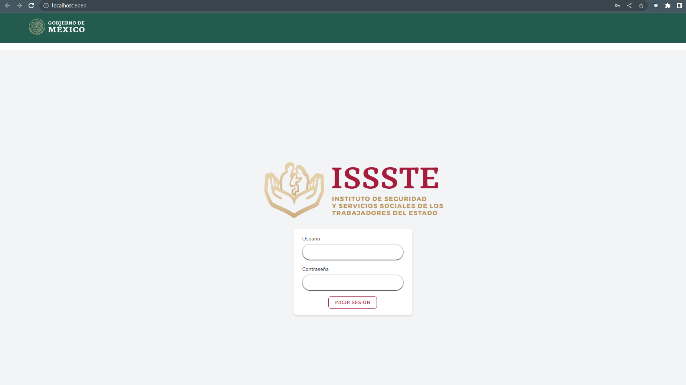 <br />


## AGREGAR LA BASE DE DATOS AL CONTENEDOR

Finalmente tienes que agregar la base de Datos al Contenedor del administrador de la Base de Datos (MySQL).

- **Agregar el archivo issste.sql al contenedor de la Base de Datos** <br />

  - Para ejecutar el comando asegurate de navegar hasta la ruta principal del proyecto.
  - Antes de copiar el archivo es importante validar el nombre del conedor de la Base de Datos ya que éste cambio segun el Sistema Operativo
    - **En la Terminal (Linux) ó CMD/PowerShell (Windows)**<br />
    Ejecuta el siguiente comando:
      ```sh
      docker container ls
      ```
       <br />
      **El nombre del contenedor *"docker-issste_mysql_db_1"* puede cambiar entre *"_"(guión bajo)* ó *"-"(guión medio)* como en éste ejemplo:**
      ***"docker-issste-mysql_db-1"***

    - **Despues de haber definido el nombre del contenedor de la Base de Datos procede a ejecutar el siguiente comando para copiar la Base de Datos al contenedor.**

    **Ej: /home/usuario/project/siraesu-main/**
  
    ```sh
    docker cp ./laravel-app/public/issste.sql docker-issste_mysql_db_1:/
    ```
  - Veras un mensaje similar a éste una vez que el archivo issste.sql se haya movido al Contenedor correcto:

    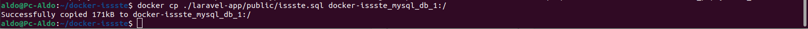 <br />

  - Tambien puedes entrar al contenedor y validar que el archivo exista en la estructura de archivos del contenedor:
  
    Ejecuta el siguiente comando:
    ```sh
    docker exec -it docker-issste_mysql_db_1 bash
    ```
    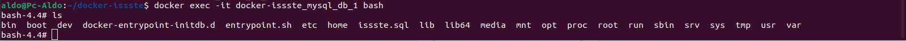 <br />

- **Agregar la Base de Datos al Administrador MySQL** <br />

  - Para ejecutar el comando asegurate de navegar hasta la ruta principal del proyecto.

    **Ej: /home/usuario/project/docker-issste/**
  
    ```sh
    docker exec -it docker-issste_mysql_db_1 bash
    ```
  'exec mysql -uroot -proot issste < issste.sql'
  - Veras una linea similar a ésta: **"bash-4.4#"** enseguida executa el siguiente comando:
    ```sh
    exec mysql -uroot -proot issste < issste.sql
    ```

  - Veras un mensaje similar a éste una vez que la Base de Datos haya sido copiada:

    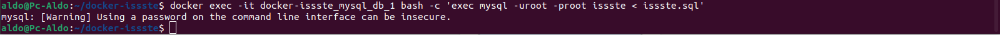 <br />


## CONSIDERACIONES FINALES

Prueba con una de las cuentas de Administrador que el acceso este funcionando correctamente:

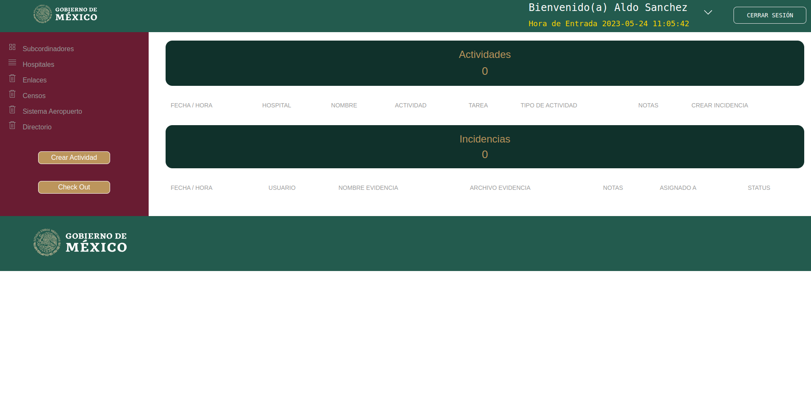 <br />